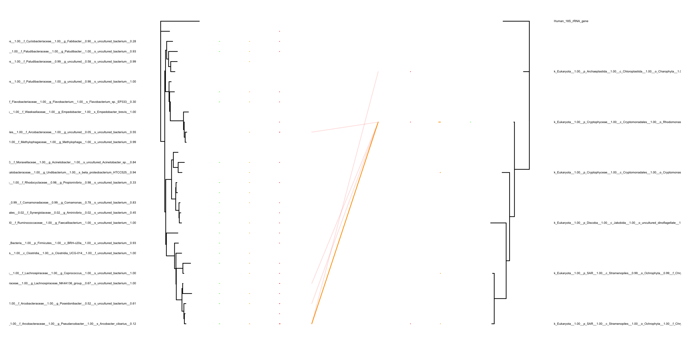

## Samples

-   RhodoM100XDilBC10e5: Only biological controls; 100X dilution of
    standards; 1e5 barcode molecules

-   WWRhodoM100XDilBC10e5: Wastewater + biological controls; 100X
    dilution of standards; 1e5 barcode molecules

-   WWM100XDilBC10e5: Only wastewater; 100X dilution of standards; 1e5
    barcode molecules

-   RhodoM100XDilBC10e6: Only biological controls; 100X dilution of
    standards; 1e6 barcode molecules

-   WWRhodoM100XDilBC10e6: Wastewater + biological controls; 100X
    dilution of standards; 1e6 barcode molecules

-   WWM100XDilBC10e6: Only wastewater; 100X dilution of standards; 1e6
    barcode molecules

-   RhodoM10XDilBC10e5: Only biological controls; 10X dilution of
    standards; 1e5 barcode molecules

-   WWRhodoM10XDilBC10e5: Wastewater + biological controls; 10X dilution
    of standards; 1e5 barcode molecules

-   WWM10XDilBC10e5: Only wastewater; 10X dilution of standards; 1e5
    barcode molecules

-   RhodoM10XDilBC10e6: Only biological controls; 100X dilution of
    standards; 1e6 barcode molecules

-   WWRhodoM10XDilBC10e6: Wastewater + biological controls; 100X
    dilution of standards; 1e6 barcode molecules

-   WWM10XDilBC10e6: Only wastewater; 100X dilution of standards; 1e6
    barcode molecules

## Barcode distributions

<table>
<tr>
<td>
Barcode distribution
</td>
<td>
Barcode taxonomy distribution
</td>
</tr>
<tr>
<td valign="top">

</td>
<td valign="top">

</td>
</tr>
</table>

## Distribution of connections

<td valign="top">

</td>

## Abundance profiles

The abundance columns are:

-   Only biological controls; 100X dilution of standards; 1e5 barcode
    molecules
-   WRhodoM100XDilBC10e5: Wastewater + biological controls; 100X
    dilution of standards; 1e5 barcode molecules
-   Only wastewater; 100X dilution of standards; 1e5 barcode molecules
-   Only biological controls; 100X dilution of standards; 1e6 barcode
    molecules
-   WRhodoM100XDilBC10e6: Wastewater + biological controls; 100X
    dilution of standards; 1e6 barcode molecules
-   Only wastewater; 100X dilution of standards; 1e6 barcode molecules
-   Only biological controls; 10X dilution of standards; 1e5 barcode
    molecules
-   WRhodoM10XDilBC10e5: Wastewater + biological controls; 10X dilution
    of standards; 1e5 barcode molecules
-   Only wastewater; 10X dilution of standards; 1e5 barcode molecules
-   Only biological controls; 100X dilution of standards; 1e6 barcode
    molecules
-   WRhodoM10XDilBC10e6: Wastewater + biological controls; 100X dilution
    of standards; 1e6 barcode molecules
-   Only wastewater; 100X dilution of standards; 1e6 barcode molecules

<td valign="top">

</td>
<td valign="top">

</td>

## Tanglegram of bc5dil100

The abundance columns are:

-   Only biological controls; 100X dilution of standards; 1e5 barcode
    molecules
-   WRhodoM100XDilBC10e5: Wastewater + biological controls; 100X
    dilution of standards; 1e5 barcode molecules
-   Only wastewater; 100X dilution of standards; 1e5 barcode molecules

Non-normalised connections
<td valign="top">

</td>
Normalised connections
<td valign="top">

</td>

## Tanglegram of bc6dil100

The abundance columns are:

-   Only biological controls; 100X dilution of standards; 1e6 barcode
    molecules
-   WRhodoM100XDilBC10e6: Wastewater + biological controls; 100X
    dilution of standards; 1e6 barcode molecules
-   Only wastewater; 100X dilution of standards; 1e6 barcode molecules

Non-normalised connections
<td valign="top">

</td>
Normalised connections
<td valign="top">

</td>

## Tanglegram of bc5dil10

The abundance columns are:

-   Only biological controls; 100X dilution of standards; 1e5 barcode
    molecules
-   WRhodoM100XDilBC10e5: Wastewater + biological controls; 100X
    dilution of standards; 1e5 barcode molecules
-   Only wastewater; 100X dilution of standards; 1e5 barcode molecules

Non-normalised connections
<td valign="top">

</td>
Normalised connections
<td valign="top">

</td>

## Tanglegram of bc6dil10

The abundance columns are:

-   Only biological controls; 100X dilution of standards; 1e6 barcode
    molecules
-   WRhodoM100XDilBC10e6: Wastewater + biological controls; 100X
    dilution of standards; 1e6 barcode molecules
-   Only wastewater; 100X dilution of standards; 1e6 barcode molecules

Non-normalised connections
<td valign="top">

</td>
Normalised connections
<td valign="top">

</td>

## Mock standard curves

<table>
<tr>
<td>
Bacteria
</td>
<td>
Eukaryotes
</td>
</tr>
<tr>
<td valign="top">

</td>
<td valign="top">

</td>
</tr>
</table>
