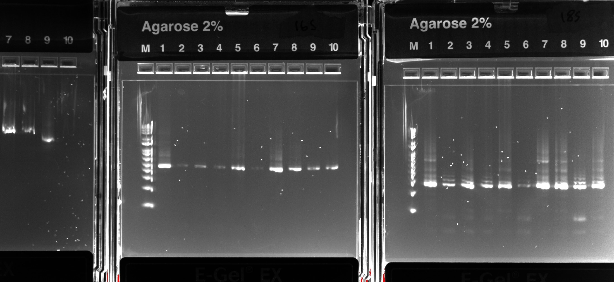

## Polyacrylamide bead formation

For each sample:

a) Combine the following reagents in a 2 ml round-bottom safe-lock microtube and vortex gently: 
- 120 µl sample material * 
- 80 µl 30% BIS/acrylamide (storage temp: 4 °C) 
- 25 µl 10% APS (storage temp: -20 °C)

*Samples:

1: Rhodomonas + Chilomonas + Ochromonas (Biological standard):
- The final cell density for approximately 40 000 cells/ml rhodomonas, 4 000 cells/ml chilomonas, and 400 cells/ml ochromonas
- 25 µl +  4 µl + 1 µl + 90 µl PCR water

2: Wastewater (ww) + Rhodomonas + Chilomonas + Ochromonas:
- 90 µl + 25 µl +  4 µl + 1 µl

3: Wastewater: 
- 120 µl

b) Shake & mix STT (Span/Tween/Triton) emulsion oil thoroughly before use!  
Add 600 µl STT emulsion oil. (storage temp: RT) 
Vortex at max speed (3 000 rpm) for 30 s.

c) Add 25 µl TEMED.  (storage temp: RT) 
Vortex at max speed (3 000 rpm) for 30 s.

d) Allow tube to sit on the benchtop for polymerization to occur for 1h 30 min

e) Removal of oil:
- Equal volumes of water and diethyl ether (at least 50 % water!) mixed, shaken and opened occasionally to prevent pressure from building up.
- Add 800 µl of diethyl ether to the tube, then immediately close, invert and flick the tube to mix the emulsion with the ether. A visible precipitate ought to form. Draw off the ether/oil mixture around the precipitate and discard. The diethyl ether wash performed twice 
- Add 1 ml of autoclaved H2O to the top of the tube and mix by flicking and inverting. Centrifuge for 30 s at 12 000rcf. Three layers should form: a bottom layer of beads, a middle cloudy layer of oil/water, and a top milky layer of oil. Draw off the top oil layer as much as possible and discard.
- Repeat the H2O wash steps until there is no remaining oil at the top of the tube and the liquid phase is transparent (at least 4 times).

f) Filtering through a 70µm filter

## Fusion PCR
The beads were suspended in 500 µl of PCR water.

Prepare the PCR master mix:
| Reagent | 1X | 12X |
| :---: | :---: | :---: |
| 5xGC buffer | 20 µl | 240 µl |
| 50 mM MgCl2 | 2 µl | 24 µl |
| dNTP mix (10 mM each) | 2.5 µl | 30 µl |
| 10 µM R2 and F1 primers (3, each) | 10 µl | 120 µl |
| 10 µM R1-F2’ and F2-R1' primers (4, each)  | 1 µl | 12 µl |
| Phusion DNA polymerase (2 U/µl) | 8 µl | 96 µl |

1 µl of barcode-DNA + 1 µl of "Mock mix" was added: 
- First set: 10e6 bc molecules, 1:10 mock mix (300 to 30 000 molecules) 
- Second set: 10e5 bc molecules, 1:10 mock mix 
- Third set: 10e6 bc molecules, 1:100 mock mix (30 to 3 000 molecules) 
- Fourth set: 10e5 bc molecules, 1:100 mock mix 

a)  Combine 33 µl of sample (bead suspension) and 67 µl of master mix. Add 100 µl of fluorinated oil with surfactant. 

b)  Place in shaker for 5 min and draw the emulsion through droplet splitter.

c)  Aliquot to two PCR tubes and cover with 50 µl of mineral oil. Chip washed with HFE7500 between samples.  

Running PCR:
| Step | Temperature (°C) | Time | Number of cycles |
| :---: | :---: | :---: | :---: |
| Beginning temperature | 80 | 10 s | 1 |
| Initial denaturation | 94 | 30 s | 1 |
| Denaturation | 94 | 5 s | 32 |
| Annealing | 55 | 30 s | 
| Extension | 72 | 30 s | 
| Final extension | 72 | 5 min | 1
| Storing temperature | 4 | Inf | 1

d) Pool the emulsion aliquots for each sample into a new safe-lock tube.

e) Separate the phases (top: mineral oil, middle: emulsion, bottom: surplus fluorinated oil) by spinning and discard the mineral oil. Some fluorinated oil may also be removed, if applicable.

f) Add 50 µl of PFO, mix and spin. The upper aqueous phase is collected / bottom phase discarded

g) Cleanup with Monarch® PCR & DNA Cleanup Kit (5 μg)

## 16S and 18S blocking

Prepare the PCR master mix:
| Reagent | 1X | 12X |
| :---: | :---: | :---: |
| PCR H2O | 7.25 µl | 282 µl |
| 5xGC buffer | 5 µl | 120 µl |
| dNTP mix (10 mM each) | 0.5 µl | 12 µl |
| 32 µM BlockF-16S and BlockR-16S primers | 2.5 µl | 60 µl |
| 32 µM BlockF-18S and BlockR-18S primers | 2.5 µl | 60 µl |
| Phusion DNA polymerase (2 U/µl) | 0.25 µl | 6 µl |

Pipette 45 µl mastermix and 5 µl template (purified fusion PCR product) to 1 well for each sample. 

Running PCR:
| Step | Temperature (°C) | Time | Number of cycles |
| :---: | :---: | :---: | :---: |
| Beginning temperature | 98 | 30 s | 1 |
| Denaturation | 98 | 10 s | 30 |
| Annealing | 55 | 30 s | 
| Extension | 72 | 30 s | 
| Final extension | 72 | 5 min | 1 |
| Storing temperature | 4 | Inf | 1 |

Cleanup with Monarch® PCR & DNA Cleanup Kit (5 μg).

## Nested PCR 

Prepare 2 PCR master mixes (with either 16S and 18S nested primers), 4x reactions per sample:
| Reagent | 1X | 25X |
| :---: | :---: | :---: |
| PCR H2O | 14.75 µl | 368.75 µl |
| 5xGC buffer | 5 µl | 125 µl |
| dNTP mix (10 mM each) | 0.5 µl | 12.5 µl |
| Primer mix * either 16S or 18S | 2.5 µl | 67.5 µl |
| Phusion DNA polymerase (2 U/µl) | 0.25 µl | 6.75 µl |

(*) Primer mixes: 
- 16S: 16S nested primers (3 primers), i5 forward, BlockF, BlockR; (3µM each) 
- 18S: 18S nested primers (3 primers), i5 forward, BlockF, BlockR; (3µM each)

Combine 23 µl mastermix + 2 µl of sample (from blocking PCR), 4 replicates each sample

Running PCR:
| Step | Temperature (°C) | Time | Number of cycles |
| :---: | :---: | :---: | :---: |
| Beginning temperature | 98 | 30 s | 1 |
| Denaturation | 98 | 10 s | 24 |
| Annealing | 55 | 30 s | 
| Extension | 72 | 30 s | 
| Final extension | 72 | 5 min | 1
| Storing temperature | 4 | Inf | 1

Replicate samples pooled and cleanup with Monarch® PCR & DNA Cleanup Kit (5 μg).

Gel electrophoresis: 
Agarose gel casket: Invitrogen E-Gel® EX with SYBR® Gold II, 2% agarose, program: E-Gel EX 1–2% (10 mins)
The samples used in sequencing highlighted with bold.

<td valign="top"></td>

Leftmost gel (re-used; lanes 7 to 10):

7. 16S Biological standard & Waste water, high bc + high mock 
8. 16S Biological standard &Waste water, low bc + high mock 
9. 18S Biological standard & Waste water, high bc + high mock 
10. 18S Biological standard & Waste water, low bc + high mock 

Middle (16S): 

M. 1 kb marker 
1. Biological standard, high bc + high mock 
2. Biological standard, low bc + high mock 
3. Biological standard, high bc + low mock 
4. Biological standard, low bc + low mock 
5. Biological standard & Waste water, high bc + low mock 
6. Biological standard & Waste water, low bc + low mock 
7. Waste water, high bc + high mock 
8. Waste water, low bc + high mock 
9. Waste water, high bc + low mock 
10. Waste water, low bc + low mock 

Rightmost gel (18S): 

M. 1 kb marker 
1. Biological standard, high bc + high mock 
2. Biological standard, low bc + high mock 
3. Biological standard, high bc + low mock 
4. Biological standard, low bc + low mock 
5. Biological standard & Waste water, high bc + low mock 
6. Biological standard & Waste water, low bc + low mock 
7. Waste water, high bc + high mock 
8. Waste water, low bc + high mock 
9. Waste water, high bc + low mock 
10. Waste water, low bc + low mock 

A band can not be seen on lane 10 on re-used gel, but I believe the cause has to do with the sample loading and the sample itself is probably still OK. 

## Indexing

16S and 18S barcoding experiments were further prepared for sequencing using indexing primers.

Primers used:

| Sample | Barcode and mock-oligos | Target | i5 primer | i7 primer | 
| :---: | :---: | :---: | :---: | :---: |
| Biol standard | 10e6, 300 to 30 000 | 16S | N701 (89) | S502 (97) |
| Biol standard | 10e5, 300 to 30 000 | 16S | N701 (89) | S503 (98) |
| Biol standard | 10e6, 30 to 3000 | 16S | N701 (89) | S505 (99) |
| Biol standard | 10e5, 30 to 3000 | 16S | N701 (89) | S506 (100) |
| Biol standard | 10e6, 300 to 30 000 | 18S | N701 (89) | S507 (101) |
| Biol standard | 10e5, 300 to 30 000 | 18S | N701 (89) | S508 (102) |
| Biol standard | 10e6, 30 to 3000 | 18S | N701 (89) | S510 (103) |
| Biol standard | 10e5, 30 to 3000 | 18S | N701 (89) | S511 (104) |
| WW + Biol standard | 10e6, 300 to 30 000 | 16S | N702 (90) | S502 (97) |
| WW + Biol standard | 10e5, 300 to 30 000 | 16S | N702 (90) | S503 (98) |
| WW + Biol standard | 10e6, 30 to 3000 | 16S | N702 (90) | S505 (99) |
| WW + Biol standard | 10e5, 30 to 3000 | 16S | N702 (90) | S506 (100) |
| WW + Biol standard | 10e6, 300 to 30 000 | 18S | N702 (90) | S507 (101) |
| WW + Biol standard | 10e5, 300 to 30 000 | 18S | N702 (90) | S508 (102) |
| WW + Biol standard | 10e6, 30 to 3000 | 18S | N702 (90) | S510 (103) |
| WW + Biol standard | 10e5, 30 to 3000 | 18S | N702 (90) | S511 (104) |
| WW | 10e6, 300 to 30 000 | 16S | N703 (91) | S502 (97) |
| WW | 10e5, 300 to 30 000 | 16S | N703 (91) | S503 (98) |
| WW | 10e6, 30 to 3000 | 16S | N703 (91) | S507 (101) |
| WW | 10e5, 30 to 3000 | 16S | N703 (91) | S508 (102) |
| WW | 10e6, 300 to 30 000 | 18S | N703 (91) | S505 (99) |
| WW | 10e5, 300 to 30 000 | 18S | N703 (91) | S506 (100) |
| WW | 10e6, 30 to 3000 | 18S | N703 (91) | S510 (103) |
| WW | 10e5, 30 to 3000 | 18S | N703 (91) | S511 (104) |

 Prepare following PCR mix :

| Reagent | 1X | 100X |
| :---: | :---: | :---: |
| H2O | 12,4 µl | 1240 µl |
| 5x HF buffer | 4 µl | 400 µl |
| dNTP mix (10 mM each) | 0,4 µl | 40 µl |
| Phusion DNA polymerase (2 U/µl) | 0,2 µl | 20 µl |
| i5 primer (10 µM) | 1 µl | - |
| i7 primer (10 µM) | 1 µl | - |

Pipette 17 µl mastermix, 1 µl of appropriate primers each, and 1 µl template (purified nested PCR product) to 4 PCR tubes per sample 

b) Run the following cycling program:

| Step | Temperature (°C) | Time | Number of cycles |
| :---: | :---: | :---: | :---: |
| Beginning temperature | 98 | 30 s | 1 |
| Denaturation | 98 | 10 s | 12 |
| Annealing | 55 | 20 s | 
| Extension | 72 | 20 s | 
| Final extension | 72 | 5 min | 1 |
| Storing temperature | 4 | Inf | 1 |

Pool replicate reactions, mix, and load 20 µl to a gel. Excise the correct-sized product and purify with Monarch® PCR & DNA Cleanup Kit (5 μg) and gel dissolving buffer.
(Agarose gel casket: Invitrogen E-Gel® EX with SYBR® Gold II, 2% agarose, program: E-Gel EX 1–2% (10 mins))

## Sample pooling and sequencing

The DNA concentration of the purified PCR products was measured by Qubit, a library was created by combining the products in equal DNA amounts, and the DNA concentration of the resulting mix was measured again for confirmation (1,8 ng/µl).  

The library was diluted to 4nM using elution buffer (Qiagen). 

Preparing the library for sequencing:

a) Prepare a Fresh Dilution of NaOH:  
- Combine the following volumes in a microcentrifuge tube: Laboratory-grade water (16 μl) + Stock 1.0 N NaOH (4 μl)  
- Invert the tube several times to mix.  

b) Prepare HT1  
- Remove HT1 from -25°C to -15°C storage and thaw at room temperature.  
- Store at 2°C to 8°C until you are ready to dilute denatured libraries.  

c) Denature a 4 nM Library :
- Combine the following volumes in a microcentrifuge tube: 4 nM library (5 μl) + 0.2N NaOH (5 μl)  
- Vortex briefly and then centrifuge at 280 × g for 1 minute.  
- Incubate at room temperature for 5 minutes.  

d) Add 990 μl prechilled HT1 to the tube containing denatured library. The result is 1 ml of a 20 pM denatured library.  

e) Dilute Denatured 20 pM Library: 
- Dilute to 6pM using the following volumes: 20 pM library (180 μl) + Prechilled HT1 (420 μl) 
- Invert to mix and then pulse centrifuge.  

The sample was loaded into the casette and the sequencing was performed in the Turku Bioscience facilities, using Illumina's MiSeq .
